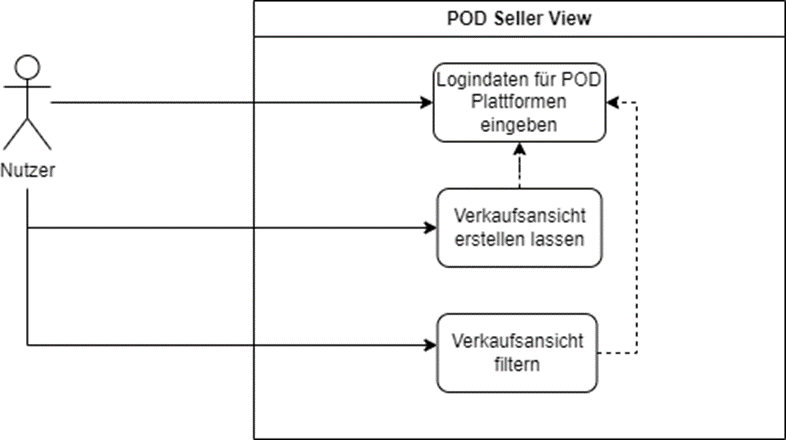
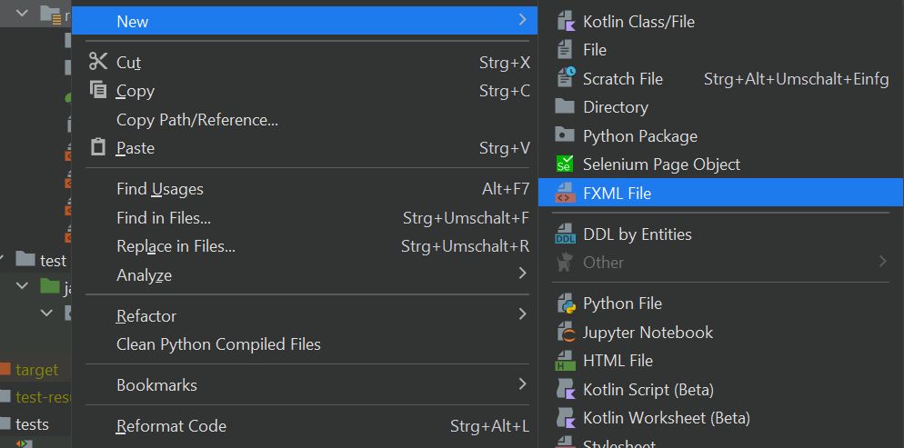
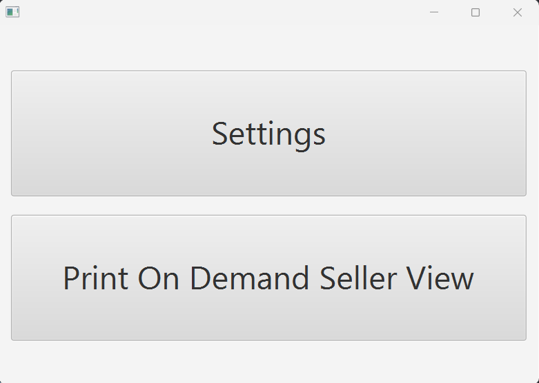
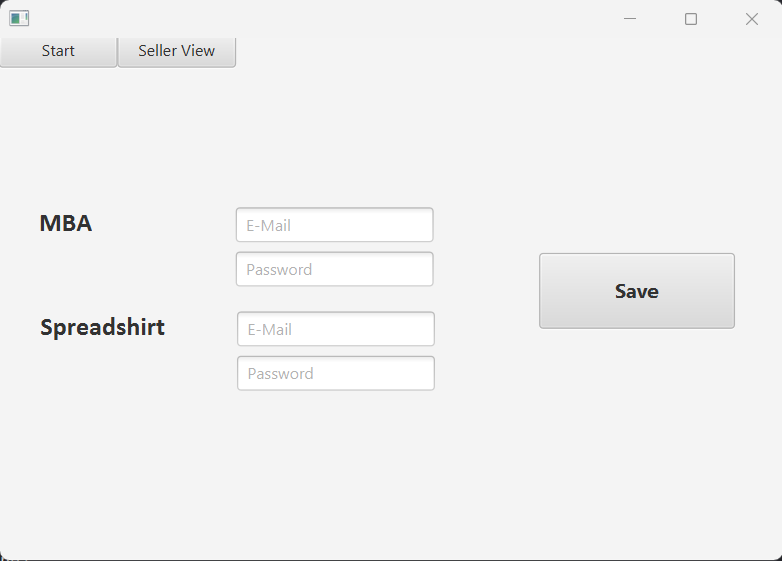
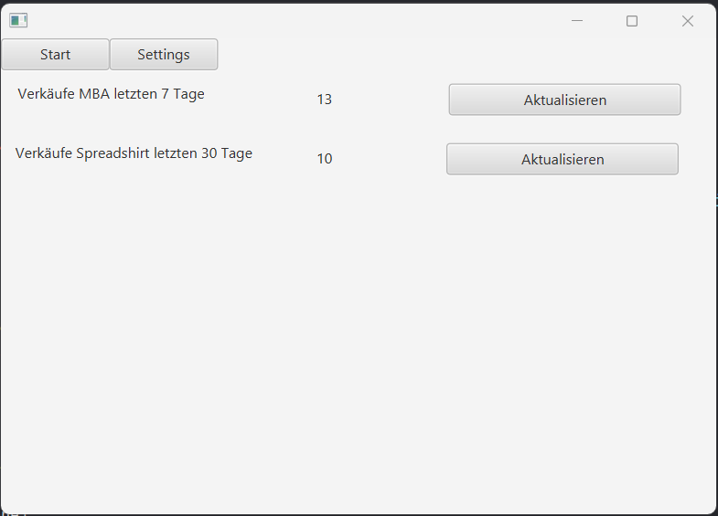

# PrintOnDemandSellerView

## Einleitung

Im Print-on-Demand-Bereich handelt es sich um eine Form der Produktion, bei der individuell gestaltete Produkte wie Bücher, Kleidungsstücke oder Kunstwerke hergestellt werden, ohne dabei hohe Lagerkosten oder Mindestbestellmengen zu haben. Im Gegensatz zu herkömmlichen Produktionsverfahren werden die Produkte erst dann hergestellt, wenn eine Bestellung von einem Kunden eingeht. Hierbei werden die Produkte entweder direkt vom Hersteller oder von einem Drittanbieter gedruckt oder produziert und dann an den Kunden versendet.

Die Print-on-Demand-Tätigkeit bietet vielen Personen die Möglichkeit, ihre kreativen Ideen und Designs auf Produkte zu bringen und diese online zu verkaufen, ohne dabei hohe Investitionskosten für Produktion, Lagerung und Vertrieb zu haben. Durch die Möglichkeit, Produkte erst bei Bedarf herzustellen, entfällt das Risiko von unverkaufter Ware oder Lagerbeständen, die nicht abgebaut werden können.

## Problemstellung

Die manuelle Erfassung von Verkaufszahlen und Umsätzen im Print-on-Demand-Bereich kann zu verschiedenen Problemen führen.

Eines davon ist eine unvollständige oder fehlerhafte Datenerfassung aufgrund von menschlichem Versagen oder vergessenen Einträgen. Dies kann zu ungenauen Ergebnissen und unvollständigen Datensätzen führen.

Ein weiteres Problem ist die verzögerte Aktualisierung der Buchhaltungsunterlagen aufgrund von fehlender Zeit oder Prioritätensetzung. Dies kann zu Schwierigkeiten bei der Erstellung von Berichten oder Analysen führen, insbesondere wenn die Datensätze unzureichend oder inkonsistent sind.

Eine fehlende Automatisierung von wiederkehrenden Aufgaben kann zu einem höheren Arbeitsaufwand führen und somit wertvolle Zeit und Ressourcen in Anspruch nehmen.

Schließlich kann die Skalierbarkeit bei steigendem Arbeitsvolumen oder einer zunehmenden Anzahl von Webseiten oder Vertriebskanälen eingeschränkt sein. Eine automatisierte Lösung kann diese Probleme lösen, indem sie menschliche Fehler minimiert, eine schnellere Aktualisierung der Buchhaltungsunterlagen ermöglicht, die Erstellung von Berichten und Analysen erleichtert, wiederkehrende Aufgaben automatisiert und eine Skalierung der Arbeit ermöglicht.

## Lösungsansatz und Zielsetzung

Die Zielsetzung ist die automatisierte Erfassung durch Webscraping der Verkaufs- und Umsatzzahlen im Print-on-Demand-Bereich durch die Entwicklung eines Rich-Clients. Hierfür soll ein Programm entwickelt werden, das die Logindaten und Passwörter des Benutzers für die jeweiligen Print-on-Demand-Webseiten lokal auf dem Rechner speichert und über eine grafische Oberfläche zugänglich macht. Der Benutzer soll die Möglichkeit haben, zu bestimmen, welche Verkaufs- und Umsatzzahlen von welchen Seiten und in welchen Zeitperioden herausgefiltert werden sollen.

## Entwicklung

### Anwendungsfälle der Benutzer

Die Software vereinfacht den Verwaltungsprozess durch zwei Hauptanwendungsfälle:

1. Logindaten für Print-On-Demand Plattform eingeben und eine Verkausansicht erstellen lassen
   Benutzer können ihre Logindaten für verschiedene Print-On-Demand Plattformen in der Software eingeben. Dadurch wird eine zentrale Verkaufsansicht erstellt, die alle Verkäufe aus den verschiedenen Plattformen zusammenfasst. Dies erleichtert die Verwaltung und ermöglicht einen besseren Überblick über die Verkaufsaktivität.
2. Verkaufsansicht für eine Print-On-Demand Plattform filtern
   Die Software bietet die Möglichkeit, die Verkaufsansicht nach verschiedenen Kriterien zu filtern, sodass Benutzer gezielt Verkaufsinformationen auswählen und analysieren können. Durch das Anwenden von Filtern können Benutzer ihre Verkäufe besser verwalten.

### Use Case Diagramm



### Technologieauswahl

Die folgenden Aspekte wurden bei der Technologieauswahl berücksichtigt:

1. Java: Aufgrund von umfangreicher Erfahrung im Vergleich zu anderen Programmiersprachen wurde Java als bevorzugte Sprache gewählt.
2. GUI-Framework: JavaFX wird als exklusives GUI-Framework verwendet, um ansprechende Benutzeroberflächen zu erstellen. Insbesondere in Kombination mit dem SceneBuilder gestaltet sich die Entwicklung benutzerfreundlich und effizient.
3. Spring Boot: Um die Java-Entwicklung zu vereinfachen, wird Spring Boot eingesetzt. Dies bietet Vorteile wie einen integrierten Webserver und vereinfachte Testmöglichkeiten.
4. Playwright: Nach anfänglichen Schwierigkeiten mit Selenium und aufgrund von Konfigurationsproblemen in Verbindung mit Spring Boot wurde Playwright als bevorzugte Technologie für das Webscraping gewählt.

### Klassen und Methodenreferenz

[Javadoc](https://github.com/maikLoewenML/PrintOnDemandSellerView/tree/main/PrintOnDemandSellerViewJavadoc)

### Domain Modell

* Wo sind Aggregatgrenzen?

  * es gibt bisher nur zwei Entities (Amazon Merch on Demand und Spreadshirt)
  * bilden jeweils ein eigenes Aggregate Root
  * Können ohne einander auskommen

### Entwicklungsstrategie und Systemkonfiguration

#### Erstellung einer Springboot Applikation

Die Spring Boot Applikation wurde mithilfe des Spring Initializr generiert und anschließend in IntelliJ importiert. Für die Entwicklung wurden folgende Technologien und Werkzeuge ausgewählt:

* Buildtool: Maven
* Java-Version: 11
* Lombok Plugin

Das Lombok Plugin wurde verwenet, um Boilerplate-Code zu reduzieren und die Lesbarkeit des Codes zu erhöhen.

#### Datenbankanbindung

Für die Datenverarbeitung wurde eine H2-Datenbank integriert. Die H2-Datenbank ist eine leichte und leistungsfähige In-Memory-Datenbank, die sich gut für die Entwicklung und das Testen von Spring Boot Applikationen eignet.

#### Einrichtung der Amazon Merch On Demand Entity und zugehöriger Komponenten

Die erste Entity, die für das Projekt erstellt wurden, beziehen sich auf die Seite "Amazon Merch On Demand". Um dies zu erreichen, wurde zunächst das Package [amazonMerchOnDemand ](PrintOnDemandSellerView/src/main/java/com/example/printondemandsellerview/amazonMerchOnDemand)angelegt. Innerhalb dieses Packages werden alle relevanten Komponenten für die Amazon Merch On Demand Funktionalität abgebildet.

Die Entity [Amazon Merch On Demand](PrintOnDemandSellerView/src/main/java/com/example/printondemandsellerview/amazonMerchOnDemand/AmazonMerchOnDemand.java) besitzt die Attribute E-Mail und Passwort, welche die Anmeldedaten des Benutzers für die Print-On-Demand Webseite speichert. Weitere Print-On-Demand Webseiten werden die gleichen Attribute besitzen.

Zusätzlich wurden ein [Repository](PrintOnDemandSellerView/src/main/java/com/example/printondemandsellerview/amazonMerchOnDemand/AmazonMerchOnDemandRepository.java) und ein [Service](PrintOnDemandSellerView/src/main/java/com/example/printondemandsellerview/amazonMerchOnDemand/AmazonMerchOnDemandService.java) für die Entity [Amazon Merch On Demand](PrintOnDemandSellerView/src/main/java/com/example/printondemandsellerview/amazonMerchOnDemand/AmazonMerchOnDemand.java) erstellt. Diese beiden Komponenten werden später mit weiteren Funktionen befüllt.

#### Integration von JavaFX in die Applikation

Um JavaFX in einer Applikation anwenden zu können, muss zuerst die JavaFX-Bibliothek heruntergeladen und installiert werden. Die neueste Version von JavaFX kann von der offiziellen [Webseite](https://gluonhq.com/products/javafx/) von Gluon heruntergeladen werden. In dieser Applikation wurde mit openjfx-19 getestet.

Sobald JavaFX heruntergeladen ist, müssen die VM-Optionen in der IntelliJ-Entwicklungsumgebung konfiguriert werden: Run -> Edit Configurations.

Um JavaFX in der Anwendung zu verwenden, muss der Java Virtual Machine (JVM) beim Starten der Anwendung bestimmte Parameter und Ressourcen zur Verfügung gestellt werden. Folgender Befehl muss in die VM-Options eingefügt werden:

`--module-path "\path\to\javafx-sdk-20\lib" --add-modules javafx.controls,javafx.fxml`

Dieser Befehl muss an die Version von JavaFX angepasst werden, die heruntergeladen wurde, sowie an den Dateipfad, wo JavaFX gespeichert ist.

Nachdem die VM-Options konfiguriert wurden, kann die erste fxml-Datei erstellt werden. Daran muss noch erst mal nichts geändert werden.



Danach wird neben der SpringBoot-Applikation noch eine Main-Klasse für JavaFX erstellt. Darin muss die fxml-Datei über den FXML-Loader erstellt werden. Der folgende Code ist ein Beispiel, wie die [JavaFXApplication::start()](PrintOnDemandSellerView/src/main/java/com/example/printondemandsellerview/JavaFXApplication.java#L38) anfänglich aussah.

```@Override
public void start(Stage primaryStage) throws IOException {
Parent root = FXMLLoader.load(getClass().getResource("main.fxml"));
Scene scene = new Scene(root);
primaryStage.show();
}
```

Dieser Code lädt eine fxml-Datei main.fxml und zeigt sie in einem neuen Fenster an, wenn diese ausgeführt wird.

#### Das Zusammenspiel zwischen Spring und JavaFX

Die Klasse [SpringFXMLLoader](PrintOnDemandSellerView/src/main/java/com/example/printondemandsellerview/SpringFXMLLoader.java) ist verantwortlich für das Laden von FXML-Dateien in der Spring Boot-Anwendung und die Integration der Spring-Beans in das JavaFX-Interface. Die Klasse erstellt eine Instanz von FXMLLoader und konfiguriert sie, sodass sie Spring-Beans als Controller-Instanzen verwendet. Der generische Typ S repräsentiert den Root-Elementtyp der FXML-Datei und T repräsentiert den Typ des Controllers.

Die Methode [load()](PrintOnDemandSellerView/src/main/java/com/example/printondemandsellerview/SpringFXMLLoader.java#L48) lädt die FXML-Datei und konfiguriert den FXMLLoader. Darin werden Charset, Ressourcen und URL (falls vorhanden) gesetzt. Die ControllerFactory wird auf applicationContext::getBean gesetzt, um Spring-Beans als Controller zu verwenden. Dann wird eine BuilderFactory erstellt, um Beans basierend auf ihrem Typ zu laden. Danach wird die FXML-Datei geladen und der Controller gespeichert.

Außerdem ist zu erwähnen, dass die innere [Builder-Klasse](PrintOnDemandSellerView/src/main/java/com/example/printondemandsellerview/SpringFXMLLoader.java#L113) es ermöglicht, eine Instanz vom [SpringFXMLLoader](PrintOnDemandSellerView/src/main/java/com/example/printondemandsellerview/SpringFXMLLoader.java) schrittweise zu erstellen. Sie hat Methoden, um den ApplicationContext, die URL oder den InputStream, die Ressourcen und das Charset zu setzen. Die Methode [build()](PrintOnDemandSellerView/src/main/java/com/example/printondemandsellerview/SpringFXMLLoader.java#L151) erstellt eine neue Instanz vom [SpringFXMLLoader](PrintOnDemandSellerView/src/main/java/com/example/printondemandsellerview/SpringFXMLLoader.java) und [load()](PrintOnDemandSellerView/src/main/java/com/example/printondemandsellerview/SpringFXMLLoader.java#L164) lädt die FXML-Datei direkt.

Die Klasse [JavaFXApplication](PrintOnDemandSellerView/src/main/java/com/example/printondemandsellerview/JavaFXApplication.java) verwendet die Annotation "@SpringBootApplication", um zu signalisieren, dass es sich um eine Spring-Boot-Anwendung handelt.

Danach wird ein ConfigurableApplicationContext angelegt. Dies ist eine Erweiterung des ApplicationContext-Interfaces aus dem Spring-Framework. Diese bietet eine erweiterte Schnittstelle zur Konfiguration und Verwaltung des Anwendungskontextes und kann aktiv verwaltet werden, z.B. durch das Starten, Stoppen oder Neustarten der Anwendung. In der Klasse [JavaFXApplication](PrintOnDemandSellerView/src/main/java/com/example/printondemandsellerview/JavaFXApplication.java) wird der ConfigurableApplicationContext verwendet, um den Spring-Kontext zu konfigurieren und zu starten, um dann die FXML-Datei [start.fxml](PrintOnDemandSellerView/src/main/resources/start.fxml) zu laden und die Anwendung zu starten.

Die Methode [init()](PrintOnDemandSellerView/src/main/java/com/example/printondemandsellerview/JavaFXApplication.java#L27) wird von JavaFX aufgerufen, um die Anwendung zu initialisieren. Hier wird ein neues Objekt vom SpringApplicationBuilder erstellt und konfiguriert, um die Quellklasse [PrintOnDemandSellerViewApplication](PrintOnDemandSellerView/src/main/java/com/example/printondemandsellerview/PrintOnDemandSellerViewApplication.java) als Quelle für die Anwendung zu verwenden.

Die [start()](PrintOnDemandSellerView/src/main/java/com/example/printondemandsellerview/JavaFXApplication.java#L38)-Methode ist der Hauptpunkt der JavaFX-Anwendung. Hier wird die Oberfläche der Anwendung erstellt und angezeigt. Zunächst wird ein [SpringFXMLLoader](PrintOnDemandSellerView/src/main/java/com/example/printondemandsellerview/SpringFXMLLoader.java)-Objekt erstellt, das den Spring Anwendungskontext und den Pfad zur FXML-Datei [start.fxml](PrintOnDemandSellerView/src/main/resources/start.fxml) verwendet, um die Benutzeroberfläche zu laden. Dann wird die geladene Szene auf der Stage gezeigt.

Die [stop()](PrintOnDemandSellerView/src/main/java/com/example/printondemandsellerview/JavaFXApplication.java#L51)-Methode wird aufgerufen, wenn die JavaFX-Anwendung beendet wird. In dieser Methode wird der Spring-Anwendungskontext geschlossen und Platform.exit() aufgerufen, um sicherzustellen, dass die JavaFX-Anwendung ordnungsgemäß beendet wird.

#### Kommunikation zwischen Frontend und Backend

Der JavaFX Scene Builder ist ein visuelles Layout-Tool, mit dem JavaFX-Anwendungen erstellt werden können, indem FXML-Dateien bearbeitet werden.

Im SceneBuilder muss die Controller-Klasse angegeben werden, die mit der fxml-Datei kommuniziert. Diese Controller-Klasse kann dann weitere Anweisungen über Funktionen an das Backend geben. Im SceneBuilder ist außerdem möglich direkt bestimmte Funktion bei onAction()-Events zu triggern

#### Einbindung und Verwendung vom JavaFX SceneBuilder

Der Scene Builder kann [hier](https://gluonhq.com/products/scene-builder/) heruntergeladen werden. Um den SceneBuilder in Intellij IDEA zu integrieren, muss unter "File -> Settings -> Languages & Frameworks -> JavaFX" die ausführbare Datei des JavaFX SceneBuilders angegeben werden. Um eine FXML-Datei im SceneBuilder zu öffnen, kann mit einem Rechtsklick auf die Datei unter "Open in Scene Builder" das Tool gestartet werden. Über die grafische Oberfläche, die geöffnet wird, kann die fxml-Datei über Drag-and-Drop bearbeitet werden.

#### Einbindung von Print-On-Demand Seiten

Wie oben erwähnt unter "Einrichtung der Amazon Merch On Demand Entity und zugehöriger Komponenten" sind werden die Entities die gleichen Attribute haben. Das Package besteht aus dem Service, inder die Vorgänge gesteuert werden, dem Repository, indem die Logindaten gespeichert werden und dem Scraper, der sich Print-On-Demand Plattform einloggt und die Verkäufe ausliest.

#### Webscraping

In diesem Projekt wurden zunächst Startschwierigkeiten mit Selenium aufgrund von Problemen in der Konfiguration im Zusammenhang mit Spring Boot festgestellt. Deshalb wurde die Entscheidung getroffen, [Playwright](https://playwright.dev/java/docs/intro) als Alternative zu verwenden.

Um Playwright zu installieren, muss folgender Befehl in der Konsole ausgeführt werden.

`npm init playwright@latest`

Nach der erfolgreichen Installation führte der Entwicklungsprozess Schritt für Schritt die Aktionen durch, die auch manuell ausgeführt werden, wenn die Verkäufe ausgelesen werden. Dabei mussten die Captchas manuell gelöst werden, da ihre Komplexität ein separates Problem darstellt, das in diesem Projekt nicht behandelt wird.

Es ist wichtig zu beachten, dass zwischen den Befehlen manchmal Wartezeiten eingefügt werden müssen, da das Laden der Seite nicht immer schnell genug erfolgt. Diese Wartezeiten stellen sicher, dass alle notwendigen Informationen korrekt geladen und verarbeitet werden können.

Für den [AmazonMerchScraper](PrintOnDemandSellerView/src/main/java/com/example/printondemandsellerview/amazonMerchOnDemand/AmazonMerchScraper.java) und den [SpreadshirtScraper](PrintOnDemandSellerView/src/main/java/com/example/printondemandsellerview/spreadshirt/SpreadshirtScraper.java) musste ein separates Skript geschrieben werden, weil sich die Webseiten voneinander unterscheiden.

## Prozess

Zuerst ist man auf der Einstiegsseite und man kann über zwei Buttons bestimmen, ob man zur [PrintOnDemandSellerView](PrintOnDemandSellerView/src/main/resources/podsellerview.fxml) möchte oder zu den [Settings](PrintOnDemandSellerView/src/main/resources/settings.fxml).



In den [Settings](PrintOnDemandSellerView/src/main/resources/settings.fxml) können die Logindaten für die zwei Print On Demand Seiten Amazon Merch On Demand und Spreadshirt angegeben werden. Mit einem Klick auf Speichern werden die Daten temporär gespeichert.



Danach kann mit einem Klick oben auf die Leiste zur [SellerView](PrintOnDemandSellerView/src/main/resources/sellerView.fxml) gesprungen werden. In der Seller View kann mit einem Klick auf Aktualisieren die aktuellen Verkäufe geladen werden. Bei Amazon Merch On Demand werden aktuell die Verkäufe der letzten 7 Tage angezeigt und bei Spreadshirt werden die Verkäufe der letzen 30 Tage angezeigt.



Im folgende ein Video, das den Prozess nochmal veranschaulichen soll.

[Aufzeichnung Seller View](https://github.com/maikLoewenML/PrintOnDemandSellerView/blob/0abb576808d32de8a45b1daf5a6aadc471f45db7/Aufzeichnung%20SellerView.mp4)

## Ausblick

Die Software für Print-On-Demand Webseiten wurde entwickelt, um beliebig viele solcher Webseiten nach dem gleichen Prinzip hinzufügen zu können. Ein nächster Schritt wäre die Integration weiterer bekannter Print-On-Demand Webseiten wie RedBubble, Society6 und Tostadora.

Aktuell werden die Logindaten nur temporär gespeichert. Eine sinnvolle Verbesserung wäre, diese Daten lokal in einer Datei abzulegen, auf die der Nutzer bei erneutem Öffnen der Applikation zugreifen kann.

Um die Software weiter auszubauen, sollten in der Print-On-Demand Seller View Filter hinzugefügt werden. Diese würden es den Nutzern ermöglichen, nach bestimmten Zeiträumen sowie Verkäufen und Umsätzen zu filtern. Zudem wäre ein weiterer Filter hilfreich, der es ermöglicht, nur nach bestimmten Print-On-Demand Seiten zu filtern, falls man die Verkäufe in einem bestimmten Zeitraum für bestimmte Seiten einsehen und andere ausschließen möchte.

Die grafische Oberfläche der Software ist derzeit nur funktional und sollte für eine angenehmere Benutzererfahrung weiterentwickelt werden. Eine mögliche Verbesserung wäre die Darstellung der Verkäufe in Form von anpassbaren Graphen, bei denen die Zeit auf der x-Achse und die Verkäufe sowie der erzielte Umsatz an einem Tag auf der y-Achse abgebildet werden. Um die grafische Oberfläche weiter auszubauen, sollten Farben integriert werden, wobei die Hauptfarben Orange und Blau sein sollten.
